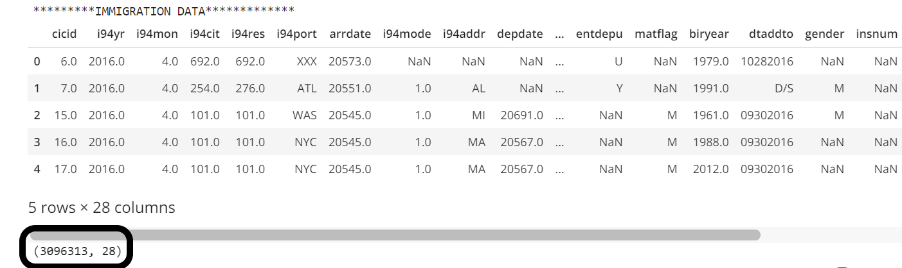
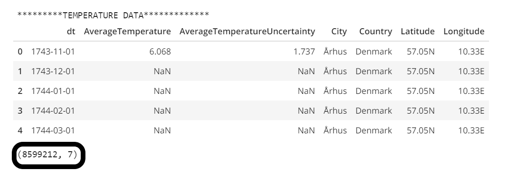
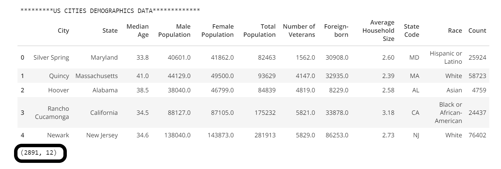
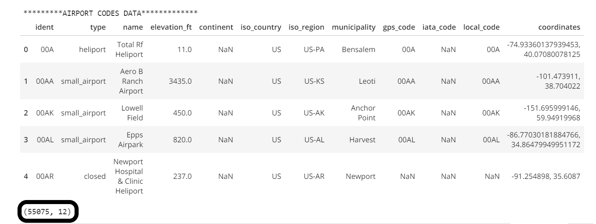
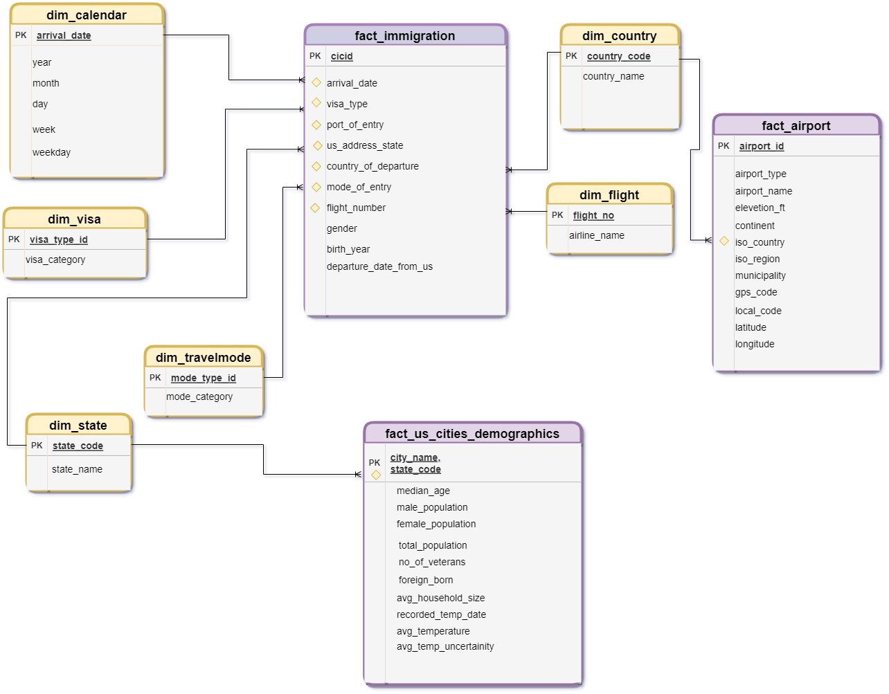
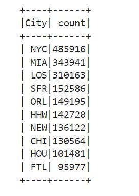
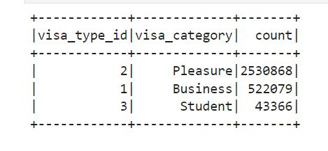

# <u>USA Immigration Data Analysis</u>
## Data Engineering Capstone Project <br>

### Project Summary:
This project aims to create an ETL Pipeline for the US Immigration Dataset and other supplemantary datasets which includes: data on airport codes, U.S. city demographics, and temperature datasets for different cities. The ETL pipeline involves steps to fetch the raw datasets provided by the Udacity team, do exploratory data analysis on these datasets, process them and finally create analytics tables in a S3 datalake, which could further be utilised by the analytics team,<br>
>##### To perform analysis to answer questions like:
Which city has the highest records of being the port of entry by the immigrants in US? How long do immigrants tend to stay in US? What is the most common reason for the immigrants to travel to US?
>##### To withdraw corelations like:
What impact does temperature has on the count of number of immigrants? What is the relation between number of travels and city demographics in US?
<br><br>


---------------------------------------------------------------
### Step 1: Project scope and data gathering process:

#### <u>Scope</u>
The purpose of the project is to build an end-to-end ETL pipeline to create a schema-on-read datalake. Raw data provide by the Udacity team is first fetched, cleaned,and processed to create analytics fact and dimension tables in a S3 datalake. As described above in some example use-cases, these tables can be further utilised to draw corelation within datasets and for analytics purpose.

Tools and technologies used in this project are: `Python libraries like Pandas, Numpy, Configparser, os, etc.`, `PySpark`, `AWS Services like AWS IAM, AWS S3`, `Jupyter Notebook` etc.<br>
Pyspark and Pandas has been used to load data into dataframes, explore and process them. Then these processed datasets are stored in AWS S3 as fact and dimension tables in `parquet` file format using spark. Parquet files store data in columnar format, which have better performance on aggregation queries. Finally, data quality checks for Primary key constraints and rowcount is run on the above created tables. <br>

#### <u>Describe and Gather Data </u>
Following datasets have been used in this project:
- `I94 Immigration Data`:This data comes from the US National Tourism and Trade Office.Dataset consists of 12 files containing data for each month. Each file has around 3 million rows and 28 columns. A data dictionary explaining columns is also included at data/I94_SAS_Labels_Descriptions.SAS. [ NOTE: Data inside sas_data dir contains data for April 2016 and thus can also be used to perform this analysis. Similarly, in code we have processed data only for month of April. ]


- `World Temperature Data`: This dataset came from Kaggle. This contains temperature data for different cities for countries across the world. For this project we have used the temperature recorded for only US cites in csv format. Also, since the provided dataset had data last data from year 2013, so we have extracted latest records only from this datset for various cities in US.


- `U.S. City Demographic Data`: This data comes from OpenSoft and have been provided as csv file. It contains various demographics attribute for the cities in US like population count, their median age, average household size, etc.


- `Airport Code Data`: This is a csv file of airport related data like airport codes, airport name, their location, etc.
<br><br>


------------------------------------------------------------
### Step 2: Data Assesment and data exploration
#### Data quality issues:
All datasets have checked for datatypes, missing values, duplicate records, invalid values, etc.
#### Data Cleaning
Data transformation and handling of above mentioned issue has been done while creating fact and dimension tables in the ETL Pipeline creation.

[NOTE:Capstone Project.ipynb has detailed EDA steps.]

`I94 Immigrations datasets section`:
 - Date columns are present in SAS format. They need to be transformed.
 - Invalid destination cities: missing port code or ports of entry don't belong to US.
 - Missing values for many columns that we will be using as per our data model: i94addr,departure date,fltno.
     (We will drop other cols as they are not going to be used)
 - No Duplicated rows.
 
 
`World Temperature Data`:
 - dt column needs to be renamed and changed to datetime format.
 - this dataset has temperature records for cities all over the world, but as per our data model
   we are interested in US cities only.
 - rename columns as per datamodel and change to lowercase for merging with demographics dataset.
 - last data was updated in year 2013, but immigration data was provided for 2016. Thus, we will extract latest records only.
 - AverageTemprature and AverageTemperatureUncertainty has missing values which needs to be handled.
 - No Duplicated rows.
 

`U.S. City Demographic Data`: 
- columns names have whitespce, '-' and to be transformed/renamed to lowercase or as per data model schema.
- very few null values present for a few columns like Male Population, Female Poulation, no. of veterans etc,
  which can be dropped
- Duplicate rows are present due to Race and Count columns which can be filtered out as we don't need them as per data model.


`Airport Code Data`:
-  columns are to be renamed and datatypes are to be changed as per the data model
- No Duplicate records
- Drop column iata_code as more than 80% records are null for this column.
- Handle missing values for contient column by populating null values based on other rows for same column using column
  iso_country.
- Create two new columns from coordinate column i.e 'latitude' and 'longitude' and round data upto two decimal values.
  Hence coordinate column is also to be dropped.
<br><br>

------------------------------------------------------------
### Step 3: Data Modelling
Below is the conceptual design for the analytical tables built in AWS S3 datalake. The following ***design strategies*** have been incorporated:
 1. A **fact constellation schema** has been designed, to allow heavy analytical query processing on the datalake.
 2. Multiple facts tables and shared dimension tables haven been created in S3 datalake to model the datasets in this schema.
 3. The different components of fact constellation schema incude:
 
    - **Fact Tables**: fact_us_cities_demographics, fact_immigration, fact_airport<br>
    - **Dimension Table**: dim_calendar, dim_visa, dim_country, dim_state, dim_travelmode, dim_flight
    
 4. These tables have been partitioned on different columns to achive storage and data retrival optimisation.
 
 
 <br><br>
 
 
------------------------------------------------------------
### Step 4: ETL Pipeline, Data Dictionary and Data Quality Checks

#### <u>ETL steps</u>
1. Fetch the config details like AWS Credentials, AWS S3 Bucket path from the config file.
2. Load the provided raw datasets using python pandas and pyspark session object, perform data cleaning by filtering null values and data transformation on these datasets to create following tables as per above defined data model: fact_us_cities_demographics, fact_immigration, fact_airport, dim_calendar, dim_flight. 
    - for fact_immigration columns are renamed as per the data model, date columns are transformed from sas date format to datetime date format and data is saved by creating partions on arrival_date.
    - dim_flight is cleaned by dropping duplicates and filtering null values for the primary key.
    - dim_calendar is cleaned by dropping duplicates and data is partitioned by year and month
    - fact_us_cities_demographics is created using us cities demographics dataset and by fetching latest temp records from temperature dataset for corresponding cities. Data is cleaned by filtering out columns that are not required and handling missing values and transforming data as per defined schema.
    - fact_airport is created from airport codes data, by populating null values based on other rows for same column, renaming columns as per defined schema, dropping unecessary columns.
3. Parse file I94_SAS_Labels_Descriptions.SAS file and process the data by dropping duplicates and by removing missing values to create following dimension tables dim_visa, dim_country, dim_state, dim_travelmode
4. Save all the above created tables in AWS S3 in paraquet format.
5. Perform data quality checks on these tables.


#### <u>Data Dictionary</u>
##### fact_immigration: Fact table extracted from the I94 immigration SAS data.
* `cicid` = key id
* `arrival_date` = arrival date
* `visa_type` = 1 digit visa type code
* `port_of_entry` = 3 character code of destination city
* `country_of_departure` = 3 digit code of origin country
* `mode_of_entry` = 1 digit transportation mode code
* `flight_number` = flight code taken by the traveller
* `gender` = gender of traveller 
* `birth_year` = Age of traveller
* `departure_date_from_us` = depature date from US

##### fact_us_cities_demographics: Fact table extracted from US cities demographics dataset joined with temperature dataset.
* `city_name` = US city name
* `state_code` = US state code
* `median_age` = median age
* `male_population` = male population
* `female_population` = female population
* `total_population` = total population
* `no_of_veterans` = number of veterans
* `foreign_born` = number of foreign born
* `avg_household_size` = average household size
* `recorded_temp_date` = latest date on which temperature was recorded
* `avg_temperature` = average temperature on the recorded_temp_date
* `avg_temp_uncertainity` = average temperature uncertainity on the recorded_temp_date

##### fact_airport: Fact table extracted from airport codes dataset.
* `airport_id` = airport id code
* `airport_type` = Type of the airport (small, medium, large)
* `airport_name` = name of the airport
* `elevation_ft` = elevation height of the airport
* `continent` = continent in which airport is located
* `iso_country` = 2 letter code for country in which airport is located
* `iso_region` =  location in which airport is located
* `municipality` = location in which airport is located
* `gps_code` =  4 letter gps_code in which airport is located
* `local_code` = 4 letter local code in which airport is located
* `latitude` =  latitude for airport location
* `longitude` = longitude for airport location

##### dim_calendar: Dimension table extracted from the I94 immigration SAS data.
* `arrival_date` = arrival date
* `year` = arrival year
* `month` = arrival month
* `day` = arrival day of month
* `week` = arrival week of year
* `weekday` = arrival weekday

##### dim_flight: Dimension table extracted from the I94 immigration SAS data.
* `flight_no` = flight number
* `airline_name` = airline name

##### dim_visa: Dimension table extracted from I94_SAS_Labels_Descriptions.SAS
* `visa_type_id` = 1 digit code of visa type
* `visa_category` = Type of visa (business, pleasure, student)

##### dim_travelmode: Dimension table extracted from I94_SAS_Labels_Descriptions.SAS
* `mode_code` = 1 digit code of transportation mode
* `mode` = Mode of transportation (air, land, sea)

##### dim_countries: Dimension table extracted from I94_SAS_Labels_Descriptions.SAS
* `country_code` = 3 digit country code 
* `country_name` = country name

##### dim_state: Dimension table extracted from I94_SAS_Labels_Descriptions.SAS
* `state_code` = 2 digit state code 
* `state_name` = state name

#### <u>Data Quality Checks</u>
Data quality for the created records has been checked by:
* Checking the count of records in each of the tables, it should not be 0.
* Checking for primary key constraints: Checking both Unique Key contraint, that column should have no duplicates and for the NULL constraint that column should not have any NULL values.
<br><br>

------------------------------------------------------------
#### Step 5: Complete Project Write Up

#### <u>Project Files and Folders added:</u>
1. <b>config.cfg:</b> Contains users AWS credentials required to retrieve and store data on AWS S3 .(Required when you are running the script locally and not on AWS)
2. <b>etl.py / Capstone Project Template.ipynb:</b> contains pyspark code to read input data. process them using pandas and PySpark, and load output data into S3 as a set of fact and dimensional tables.
3. <b>README.md:</b> provides breif description about the project and how to run the files.
4. <b>images: </b> folder contains SS for images used in Readme file
<br>

#### <u>Steps to run the project:</u>
Follow the below steps to run the project:<br>
`Method 1:`
1. **config.cfg**: Populate this file with AWS credentials and with s3 bucket name(without quotes) if you want to run the code locally.
2. **etl.py**: run this file to read data from local, process it and load data to final analytics tables in S3.<br>

`Method 2:`
1. **Capstone Project Template.ipynb**: run this notebook's code locally, to read data from local, process it and load data to final analytics tables in S3. This notebook also contains detailed description for each step in the project.
<br>


#### <u>**Rationale for the choice of tools and technologies for the project.**</u>
As discussed above, we have used Python libraries, PySpark and AWS S3 to build ETL pipline and datalake as per the defined data model. Python file handling functions and Pandas works efficiently for small files and makes it convinient to work with multiple dataframes. And to process and save large volume dataset like i94 immigration data which contains over 3 million rows per month, Apache Spark has been used, it has many easy-to-use APIs and it executes much faster by caching data in memory across multiple parallel operations. Finally, datalake has been implemented on AWS S3 to store the fact and dimension tables with partioning for efficient and fast storage and retrival process. 
  
#### <u>**How often the data should be updated and why.**</u>
The data should be updated whenever raw data is created from the data sources.
In this project, dimension tables are created from SAS Immigration data source, so dimension tables are to be updated only when new visa category, mode of entries, cities or countries are added to Immigration data. But for fact_immigration SAS data is added monthly so data updation should be done monthly, similarly dim_flight and dim_calendar will be uppdated accordingly for new date and flight details correspondingly.
The US Cities Demographics data is updated in every ten years(reference: https://www.usa.gov/statistics). So, the fact_us_cities_demographics and fact_airport are required to be updated whenever new records are generated by their data sources.
    

#### <u>**How to approach the problem differently under the following scenarios:**</u>
   - **The data was increased by 100x.**<br>
       We are currently executing code in local mode, but by increasing the number of nodes in the cluster, spark will be able handle
       the increasing amount of data. However, an efficient approch would be to deploy this solution on AWS EMR Cluster.
       AWS supports easy scaling for this much data.<br>
       
   - **The data populates a dashboard that must be updated on a daily basis by 7am every day.**<br>
       If data was to be updated daily scheduling jobs would be an efficient solution.
       We can use any of the scheduling options available like cronjobs or serverless solutions AWS Glue, AWS lambda to process code every
       time data is recieved. Another, very efficient solution for this use case would be using scheduling tool Airflow.<br>
       
   - **The database needed to be accessed by 100+ people.**<br>
       We could move the analytics database solution to AWS Redshift Cluster, it can easily scale and can handle increasing data access
       requirements by multiple users. It is efficient to handle high concurrent and parallel access by large amount of users.
    
<br><br>

------------------------------------------------------------

### Sample Queries:
Below sample queries can be found at the end of the file-<b>Capstone Project Template.ipynb</b>:


#### 1.Top 10 cities used as port of entry:
```python
immigration_df = spark.read.parquet("s3a://juhi-capstone/fact_immigration")
immigration_df.createOrReplaceTempView("fact_immigration")
spark.sql("""
    SELECT
        port_of_entry as City,
        count(*) as count
    FROM
        fact_immigration
    GROUP BY port_of_entry
    ORDER BY 2 desc
    LIMIT 10
""").show()
```



#### 2.#Most common reason for immigrants to travel to US:
```python
visa_df = spark.read.parquet("s3a://juhi-capstone/dim_visa")
visa_df.createOrReplaceTempView("dim_visa")
spark.sql("""
    SELECT
        v.visa_type_id,
        v.visa_category,
        count(i.visa_type) as count
    FROM
        fact_immigration i,
        dim_visa v
    WHERE int(i.visa_type) = v.visa_type_id
    GROUP BY 1,2
    ORDER BY 3 desc
""").show()
```
